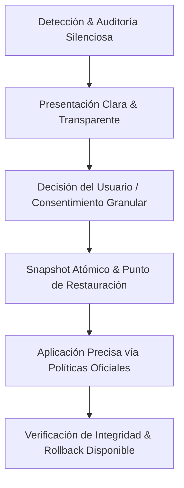

# 01. Visión y Filosofía de Pristine

> *"La verdadera privacidad no se impone con un mazo que rompe el sistema; se esculpe con bisturí de precisión milimétrica."*

---

## 1. El Problema de los "Debloaters" Tradicionales

El ecosistema actual de herramientas de privacidad y optimización para Windows está plagado de scripts de PowerShell de terceros y ejecutables improvisados que cometen errores garrafales:

1. **Destrucción Masiva e Irreversible**:
   - Eliminan de cuajo paquetes del sistema con `Remove-AppxPackage -AllUsers` sin verificar dependencias, lo que termina rompiendo la Microsoft Store, la app de Configuración o el subsistema de fotos y calculadora.
   - Detienen servicios esenciales como `WSearch`, `RpcSs`, o `CryptSvc` creyendo que son "basura", provocando que los juegos de Xbox Game Pass no arranquen o que Windows Update falle en bucle infinito con errores `0x80070002`.
2. **Fragilidad ante Actualizaciones de Windows (Feature Updates)**:
   - Modifican permisos ACL en carpetas críticas de `System32` o `WinSxS`. Cuando Microsoft despliega una actualización mayor (como 23H2, 24H2 o futuras), el instalador de Windows detecta archivos corruptos y genera pantallas azules (BSOD) o desinstala las modificaciones rompiendo registros.
3. **Cajas Negras Sin Consentimiento**:
   - El usuario pulsa un botón genérico "Optimizar" y se aplican 200 cambios ocultos a la vez. Cuando algo deja de funcionar (Bluetooth, impresión en red, HDR, micrófono en Teams), es imposible saber cuál de los 200 cambios fue el causante.
4. **Vulnerabilidades de Seguridad**:
   - Muchos scripts ejecutan descargas dinámicas vía `Invoke-RestMethod` o `curl` sin verificar firmas criptográficas, abriendo la puerta a ataques de intermediario (MitM) o elevación de privilegios no controlada.

---

## 2. El Paradigma de Pristine: "Never Break Windows"

Pristine se rige por un dogma inquebrantable: **Un sistema optimizado es inútil si no es 100% estable.**

### Principios Fundamentales:

### A. Cumplimiento de Políticas Oficiales (Policy-Driven)
En lugar de hackear binarios o forzar ACLs de Windows, Pristine utiliza:
- **Directivas de Grupo Locales (GPO / Registry Policies)** documentadas en `HKLM\Software\Policies\Microsoft\Windows`. Este es el estándar que Microsoft diseñó para entornos empresariales (Enterprise/Education).
- Desactivación limpia de tareas programadas mediante la Task Scheduler API nativa de Win32, sin borrar las definiciones para permitir una reactivación instantánea.
- Servicios configurados en `SERVICE_DEMAND_START` (Manual) o `SERVICE_DISABLED` sólo cuando no poseen dependientes activos.

### B. Consentimiento Informado y Granular
- **Cero botones mágicos a ciegas**: Cada ajuste se expone con una ficha descriptiva en la UI que detalla:
  - **Qué hace exactamente**: Clave de registro o servicio exacto modificado.
  - **Beneficio tangible**: Reducción de I/O en disco, ahorro de RAM, bloqueo de paquetes de red.
  - **Efecto secundario**: Si se desactiva una función, el usuario sabrá de antemano qué servicio asociado no estará disponible (por ejemplo: deshabilitar la telemetría de diagnóstico opcional inhabilita la participación en Windows Insider).
  - **Nivel de Riesgo**: Clasificación cromática estricta (Verde / Seguro, Amarillo / Moderado, Naranja / Específico, Rojo / Experimental).

### C. Reversibilidad Total en 1-Clic
Todo lo que Pristine toca, Pristine lo puede restaurar a su estado original exacto.
- Cada acción guarda un diff transaccional con el valor original previo.
- Un botón de "Restaurar Fábrica / Deshacer" devuelve la clave, permiso o servicio al valor original registrado antes del cambio.

---

## 3. Filosofía de Privacidad de Pristine

Pristine predica con el ejemplo:
- **100% Offline**: Pristine **no** tiene telemetría propia, **no** envía analíticas a servidores externos, **no** recopila métricas de uso ni IPs.
- **Transparencia Absoluta**: Código auditable, reproducible y compilable localmente en Rust.
- **Sin Publicidad ni Bloatware**: Pristine no promociona software de terceros ni incluye instaladores silenciosos.

---

## 4. Matriz de Perfiles de Usuario

Para simplificar la vida del usuario sin quitarle control, Pristine estructura los ajustes en tres perfiles predefinidos totalmente editables:

| Perfil | Descripción | Indicado Para |
| :--- | :--- | :--- |
| **Escudo Puro (Safe / Default)** | Elimina telemetría diagnóstica, telemetría de Edge, anuncios del menú inicio, tracking de ID de publicidad y servicios de feedback. No afecta impresoras, Xbox, Bluetooth ni actualizaciones. | Usuarios cotidianos, entornos de trabajo, máxima compatibilidad. |
| **Potencia & Privacidad (Balanced)** | Todo lo anterior más: desactivación de Copilot/Recall, optimización de Delivery Optimization (P2P), mitigación de indexación pesada y telemetría de Cortana/Bing. | Desarrolladores, creadores de contenido, entusiastas de la eficiencia. |
| **Modo Competitivo / Ultra (Isolated)** | Desactivación de telemetría agresiva, mitigación de jitter DPC, optimización de latencia de red para juegos, suspensión de servicios de diagnóstico en segundo plano. | Gamers competitivos y estaciones de producción de audio/video. |
