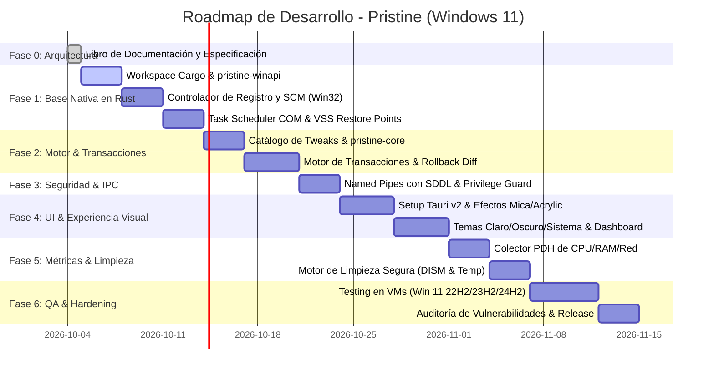

# 07. Plan de Fases, Roadmap de Desarrollo y Testing

> *"El éxito de una obra maestra reside en la disciplina del proceso: paso a paso, sin fisuras, verificando cada línea antes de dar el siguiente paso."*

---

## 1. Roadmap Estratégico de Desarrollo

---

## 2. Detalle de Fases de Ejecución

### Fase 0: Especificación y Arquitectura (Actual - Completada)
- [x] Libro técnico completo organizado en carpeta `docs/`.
- [x] Definición de principios "Never Break Windows".
- [x] Modelo de separación de privilegios (Medium UI vs High Engine).
- [x] Mapeo de telemetría de Windows 11 y catálogo de limpieza segura.

### Fase 1: Capa Nativa de Windows (`pristine-winapi`)
- Inicialización del Cargo Workspace con perfiles de compilación optimizados (`opt-level = 3`, `lto = true`, `codegen-units = 1`).
- Implementación de wrappers seguros para:
  - Registro de Windows con transaccionalidad RAII.
  - Service Control Manager (SCM) para consulta y cambio de estado de servicios.
  - Tareas programadas mediante `ITaskService` COM API.
  - Creación de puntos de restauración (`SRSetRestorePointW`).
- Suite de pruebas unitarias locales sobre claves de prueba en `HKCU\Software\PristineTest`.

### Fase 2: Núcleo y Motor de Transacciones (`pristine-core` y `pristine-engine`)
- Implementación del catálogo estático de ajustes tipados con metadata completa (ID, título, categoría, nivel de riesgo, impacto, estado actual).
- Lógica de auditoría: función `audit_system()` que devuelve el estado de cada ajuste en tiempo real.
- Motor transaccional con diario de cambios serializado y firmado con SHA-256 para rollback automático en 1-clic.

### Fase 3: Comunicación Segura de Procesos (`pristine-ipc`)
- Implementación del servidor Named Pipe en el proceso elevado con descriptor SDDL restrictivo.
- Cliente Named Pipe en la interfaz de usuario con validación estricta de payloads.
- Protocolo de comandos autenticados: `ApplyTweak(id)`, `RevertSession(id)`, `RunAudit()`, `GetLiveMetrics()`.

### Fase 4: Interfaz de Usuario y Sistema de Diseño (`pristine-app`)
- Configuración de Tauri v2 con soporte de backdrop nativo (Mica / Mica Alt / Acrylic).
- Implementación de la hoja de estilos CSS con variables de diseño, temas Claro, Oscuro y detección automática de sistema.
- Vistas completas:
  - Dashboard con Privacy Meter circular y contadores animados.
  - Vistas de Privacidad, Optimización, Servicios e Historial.
  - Modales explicativos con vista detallada de claves de registro afectadas.

### Fase 5: Motor de Métricas y Limpieza Inteligente (`pristine-metrics`)
- Colector ligero mediante PDH (Performance Data Helper) para CPU, RAM, uso de disco y contadores de firewall.
- Módulo de limpieza segura con filtro de timestamps (>24 horas) y comprobación de bloqueos de archivo.
- Disparador de limpieza DISM (`/StartComponentCleanup /ResetBase`) con reporte de espacio recuperado.

### Fase 6: Pruebas de Estrés y Compatibilidad (Matriz de Pruebas)
- Validación en máquinas virtuales limpias con diferentes versiones de Windows 11:
  - Windows 11 21H2 (Base inicial).
  - Windows 11 22H2 (Builds 22621).
  - Windows 11 23H2 (Builds 22631).
  - Windows 11 24H2 (Nueva arquitectura con Copilot+ y Recall).
- Verificación de no-regresión:
  - ¿Windows Update funciona sin errores tras aplicar todas las optimizaciones recomendadas?
  - ¿Microsoft Store y aplicaciones UWP abren correctamente?
  - ¿Los juegos de Xbox Game Pass y servicios de autenticación funcionan?
  - ¿El audio Bluetooth, micrófonos y cámaras operan sin fallos?
  - ¿El rollback en 1-clic devuelve el sistema exactamente a su estado inicial?

### Fase 7: Hardening, Auditoría de Seguridad y Binario de Rescate
- Verificación estricta de `#![forbid(unsafe_code)]` en crates de UI y lógica de negocio.
- Compilación con flags de mitigación de exploits (`/guard:cf`, ASLR de alta entropía, DEP).
- Generación del ejecutable de rescate `pristine-rescue.exe` para WinRE / Modo Seguro.
- Preparación del instalador y versión portable (.zip sin instalación).

### Fase 8: Preparación para Lanzamiento Público en GitHub
- [ ] Auditoría de cabeceras de código en cada archivo (`Author: SuperZonico`, `License: MIT`).
- [ ] Verificación exhaustiva de cero comentarios artificiales o clichés en el código fuente.
- [ ] Verificación de activos visuales: 100% iconos vectoriales SVG hechos a mano en código, cero emojis en la interfaz.
- [ ] Limpieza de rutas de depuración locales y sanitización de metadatos del binario.
- [ ] Creación de plantillas oficiales para la comunidad: `.github/workflows/ci.yml`, `SECURITY.md`, `CONTRIBUTING.md` y `LICENSE`.
- [ ] Release oficial v1.0.0 firmado y con hashes criptográficos SHA-256 para descarga pública.
